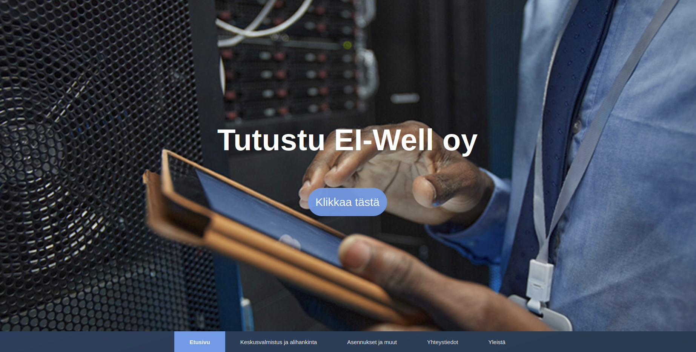
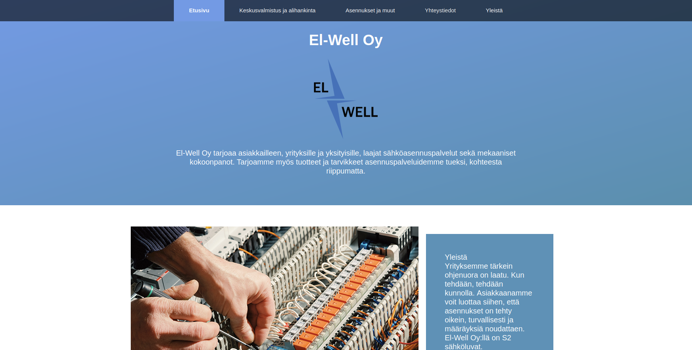

# webproject-ewell
<a href="https://akinlawrence.github.io/webproject-ewell/index.html">Try the page</a>

## About this projec
This project was made without the reliance on any external libraries or Bootstrap, because its meant to be for practising standard HTM5 L+ CSS. The primary goal was to develop  demo site specifically for the company's needs, demonstrating a commitment to precision and originality.

<h1>Homepage</h1>

 
<h1>Other view</h1>

